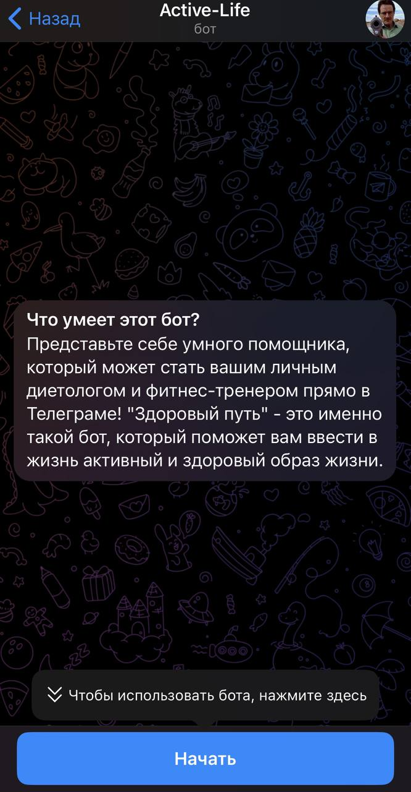

<h1 align = 'center'>Мои телеграмм боты🙋‍♂️</h1>

<h1 align = 'center'>1. Бот помощник в учебе</h1>

  

<h2 align = 'center'>Бот предназначен для облегчения моей учебы. В нем хранятся все полезные ссылки, расписание занятий</h2>

<h2 align = 'center'>файлы для бота: <u>Bot.py</u> (содержит основной код) + папка <u>picture</u>(хранит в себе изображения, которые используются в боте) </h2>

<h1 align = 'center'>2. Бот для ведения активного здорового образа жизни, включающий в себя рецепты</h1>

  

<h2 align = 'center'>Данный бот является темой проекта одногруппников. Решил его реализовать самостоятельно для укрепления знаний в создании ботов</h2>

<h2 align = 'center'>файлы для бота: <u>a study-assistance bot.py</u> (содержит основной код) + папка <u>files for study-assistance bot</u>(хранит в себе изображения, которые используются в боте) </h2>
